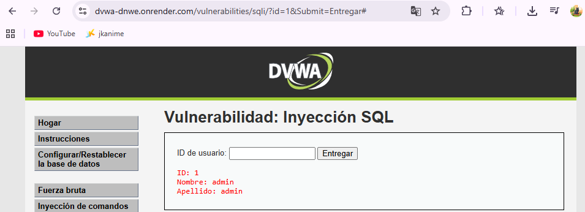

#  Análisis de Vulnerabilidad: Inyección SQL (SQL Injection)

##  Evidencia del Ataque
Durante la auditoría en el módulo de pruebas **DVWA**, se ejecutó el siguiente *payload* para verificar la vulnerabilidad:

`' OR '1'='1`

**Resultado:** La aplicación no realizó la validación de entrada adecuada, permitiendo el volcado completo de todos los registros almacenados en la base de datos.

---

##  Explicación Técnica
La inyección SQL ocurre cuando los datos proporcionados por el usuario se concatenan directamente en una consulta SQL sin validación. 

* **Mecanismo:** El *payload* utilizado altera la lógica de la consulta original, introduciendo una condición tautológica (`'1'='1'`). 
* **Consecuencia:** La base de datos ignora los filtros de seguridad y devuelve la totalidad de la información, confirmando la falta de consultas parametrizadas.

---

##  Impacto en Notaría Central Digital
Una brecha de este tipo en el portal real comprometería gravemente activos críticos:
* **Escrituras públicas y poderes notariales.**
* **Información privada y datos personales de clientes.**
* **Historial completo de trámites legales.**

**Riesgos:** Sanciones regulatorias, daño reputacional irreparable y pérdida de la confianza del cliente.

---

##  Evaluación CVSS 3.1
**Puntaje: 9.8 (Crítica)**

| Métrica | Valor |
| :--- | :--- |
| **Vector de ataque** | Red |
| **Complejidad** | Baja |
| **Privilegios** | Ninguno |
| **Interacción** | Ninguna |
| **Confidencialidad/Integridad/Disponibilidad** | Altas |

---

##  Estrategias de Seguridad

### Política de Prevención
* Adopción de **SDLC (Ciclo de Vida de Desarrollo Seguro)**.
* Validación estricta de todas las entradas del usuario.
* Prohibición absoluta de la concatenación de cadenas para consultas SQL.
* Auditorías de código y pruebas de seguridad previas a cada despliegue.

### Controles de Mitigación
1. **Consultas parametrizadas:** Uso obligatorio de *Prepared Statements*.
2. **Sanitización:** Filtrado de caracteres especiales en entradas.
3. **Principio de Mínimo Privilegio:** Restricción de permisos para las cuentas de base de datos.
4. **Monitoreo:** Registro y alerta de intentos de acceso inusuales.

---

##  Conclusión
La Inyección SQL es una vulnerabilidad crítica debido a que permite acceder y manipular información almacenada en bases de datos. En Notaría Central Digital, su explotación podría comprometer escrituras, poderes notariales y datos personales de clientes, por lo que su corrección debe considerarse una prioridad inmediata.