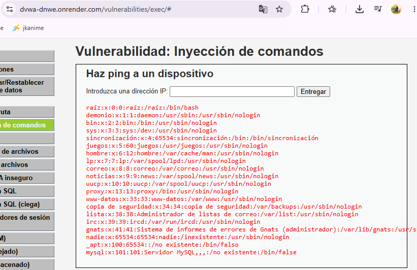

# Inyección de Comandos (Command Injection)

## Descripción de la vulnerabilidad

La vulnerabilidad de Inyección de Comandos permite que un atacante ejecute comandos del sistema operativo a través de una aplicación web que no valida correctamente las entradas del usuario. Esto puede comprometer la confidencialidad, integridad y disponibilidad de los sistemas de la organización.

## Evidencia del ataque

Payload utilizado:

```text
127.0.0.1; cat /etc/passwd
```

Resultado obtenido:

El sistema ejecutó correctamente el comando `ping 127.0.0.1` y posteriormente ejecutó el comando `cat /etc/passwd`, mostrando información sensible del sistema operativo Linux.



## ¿Por qué funciona la vulnerabilidad?

La aplicación recibe datos ingresados por el usuario y los incorpora directamente en un comando del sistema operativo sin realizar validaciones adecuadas.

Al utilizar el carácter `;`, el sistema interpreta que debe ejecutar un segundo comando independiente. De esta forma, el atacante puede ejecutar instrucciones arbitrarias sobre el servidor.

En este caso, además del comando legítimo, se ejecutó:

```text
cat /etc/passwd
```

lo que permitió visualizar información interna del sistema operativo.

## Evaluación CVSS

Puntaje CVSS v3.1: 9.8 (Crítica)

Severidad: Crítica

Justificación:

* Puede ejecutarse remotamente.
* No requiere privilegios previos.
* No requiere interacción del usuario.
* Permite comprometer completamente el servidor.

## Política de prevención

La organización debe establecer una política de desarrollo seguro que prohíba la ejecución directa de comandos del sistema operativo utilizando datos ingresados por los usuarios.

Toda entrada debe ser validada y sanitizada antes de ser procesada por la aplicación.

## Control de mitigación

Para reducir el riesgo se recomienda:

* Validar estrictamente todos los datos de entrada.
* Utilizar listas blancas de caracteres permitidos.
* Evitar el uso de funciones que ejecuten comandos del sistema.
* Aplicar el principio de mínimo privilegio al servidor.
* Mantener actualizados los sistemas y aplicaciones.
* Implementar monitoreo y registros de eventos de seguridad.

## Impacto para la empresa

Si esta vulnerabilidad fuera explotada en un entorno real, un atacante podría obtener acceso a información sensible, modificar archivos críticos, instalar software malicioso o incluso tomar control completo del servidor, generando interrupciones operativas y daños económicos para la organización.
